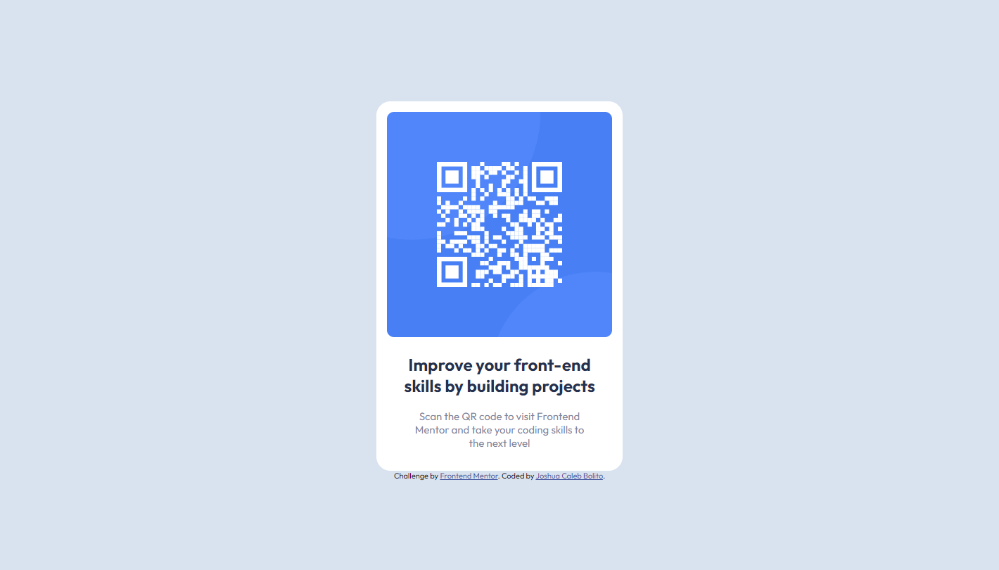

# Frontend Mentor - QR code component solution

This is a solution to the [QR code component challenge on Frontend Mentor](https://www.frontendmentor.io/challenges/qr-code-component-iux_sIO_H). Frontend Mentor challenges help you improve your coding skills by building realistic projects. 

## Table of contents

- [Overview](#overview)
  - [Screenshot](#screenshot)
  - [Links](#links)
- [My process](#my-process)
  - [Built with](#built-with)
  - [What I learned](#what-i-learned)
  - [Continued development](#continued-development)
- [Author](#author)

## Overview
This mini project involves the creation of a QR Code Component using plain HTML and CSS.
### Screenshot



### Links

- Solution URL: [GitHub Repository](https://github.com/JCBolito/FM-QR_Code_Component_Main/)
- Live Site URL: [GitHub Pages](https://jcbolito.github.io/FM-QR_Code_Component_Main/)

## My process
Breaking down the project into smaller chunks, the following process were taken to guarantee the project's completion:
1. Structure the HTML.
1. Using Flexboxes, use CSS to design the webpage.
1. Adjust the CSS to make the webpage responsive and usable for various mobile device sizes, the smallest of which it can accomodate is the Samsung Galaxy Fold. 

### Built with

- Semantic HTML5 markup
- CSS custom properties
- Flexbox

### What I learned

Upon completing this project, I was able to practice my skills in using Flexboxes and Responsive Web Design. Since this is a flexible component that does not need to have different desktop and mobile device interface, I simply maximized the capability of width, min-width, and max-width to make the component responsive.

The following block of code were used to make the component responsive:

```html
<main>
	
	<h2>Improve your front-end skills by building projects</h2>
	<p>Scan the QR code to visit Frontend Mentor and take your coding skills to the next level</p>
</main>
```
```css
main,
main img {
	min-width: 230px;
	width: 85vw;
	max-width: 320px;
}
```
As of writing this README, I've come to realize that I could've also probably maximized the use of Flexboxes by using flex-grow or flex-shrink respectively. Nonetheless, the final output was successfully replicated and is able to adapt to various device sizes.

### Continued development

Although I am satisfied with my final output on this project, I feel like I could've made everything responsive by using the capabilities of Flexboxes alone. With that, I will need to explore other feasible solutions to make the component responsive other than the one that I used for this project (width, min-width, and max-width). 


## Author

- Website - [Joshua Caleb Bolito](https://github.com/JCBolito)
- Frontend Mentor - [@JCBolito](https://www.frontendmentor.io/profile/JCBolito)
